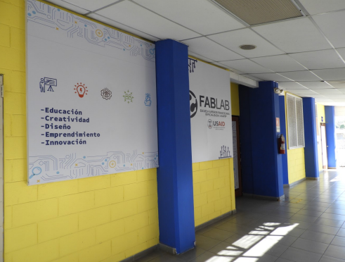
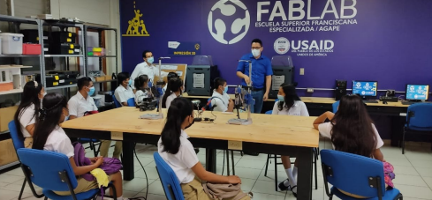
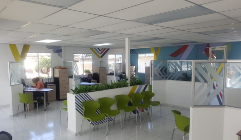
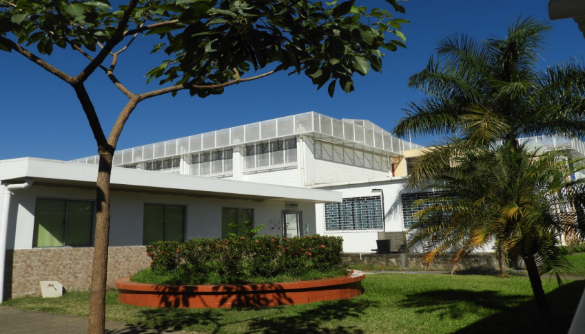
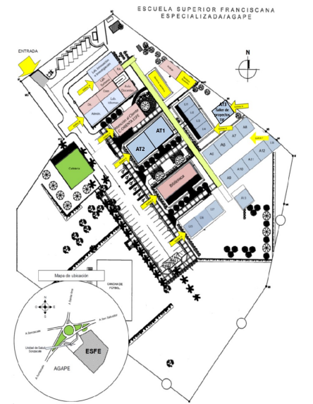

# Algunas instalaciones

## Fablab

FABALB Es un laboratorio destinado como espacio educativo y de 
investigación que facilita a los estudiantes y docentes el aprendizaje 
cooperativo en la búsqueda de soluciones a situaciones 
problemáticas a través del desarrollo de soluciones innovadoras.
Esta equipado con recursos tecnológicos y materiales para el 
desarrollo de nuevos conocimientos, competencias tecnológicas y de 
innovación a través de acciones y proyectos

## C-orienta 

## Mapa Campus de la ESFE AGAPE

