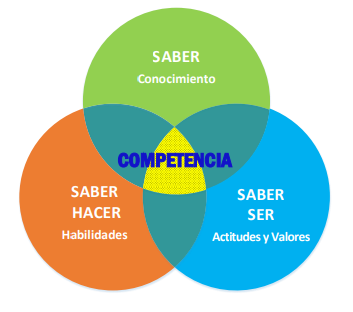

## METODOLOGÍA Y POLITICA

## METODOLOGÍA

La metodología de enseñanza de la **ESFE/ÁGAPE** se basa en un enfoque por competencias que abarca diferentes aspectos:

Nuestra educacion de basa en educación por competencías de base en saber, saber hacer y saber ser

### COMPETENCIA SABER

- **Conocimiento**: Los estudiantes adquieren conocimientos sólidos en sus áreas de estudio, lo que les proporciona una base sólida para comprender y abordar los desafíos académicos y profesionales.

### COMPETENCIA SABER HACER

- **Habilidades**: La institución se enfoca en el desarrollo de habilidades prácticas y técnicas que los estudiantes necesitan para sobresalir en sus campos respectivos.

### COMPETENCIA SABER SER

- **Actitudes y Valores**: Además de los aspectos académicos y técnicos, se promueve el desarrollo de actitudes y valores que son esenciales para la vida y el trabajo. Esto incluye la responsabilidad, la tolerancia, la justicia y la fe en valores éticos y morales que orienten la actuación en el ámbito laboral y social.

Esta metodología integral busca preparar a los estudiantes de **ESFE/ÁGAPE** de manera holística, equipándolos con conocimientos, habilidades y valores que los preparen para enfrentar los desafíos de la vida y contribuir positivamente a la sociedad.

## POLÍTICA INSTITUCIONAL

- **Política de Calidad**
Priorizar la mejora continua de la educación en cuanto a que ésta, es
un derecho inalienable de todos los jóvenes salvadoreños siendo
éstos el centro del aprendizaje.

- **Ampliar la Cobertura**
Priorizar la oferta educativa a partir de los intereses de los estudiantes
y del sector productivo de la sociedad.
Ofrecer modalidades flexibles articuladas desde el nivel medio hasta
el nivel superior universitario.
Implementar programas de educación a distancia utilizando las TIC.
Desarrollar regionales en otros departamentos del país de acuerdo a
la demanda educativa.

- **Políticas de Equidad**
Brindar a todo estudiante la posibilidad de obtener becas, a través de
mecanismos de selección.
Promover la presencia de las mujeres en carreras técnicas.
Incrementar acciones para que los estudiantes finalicen los ciclos de
estudio y puedan graduarse.

- **Gestión Transparente**
Fortalecer los sistemas administrativos-financieros.
Garantizar el uso transparente y eficiente de los recursos.
Establecer alianzas con el sector productivo y educativo del país.
Garantizar el manejo transparente y eficiente de los subsidios.

- **Políticas de Inversión**
Promover la inversión en educación a través de la venta de servicios
técnicos y de educación continua.
Gestionar convenios de cooperación técnica con organismos
nacionales e internacionales, así como con otros gobiernos.

- **Políticas y agenda de Investigación**
Realizar investigaciones Tecnológicas, de Cátedra e Institucionales con
responsabilidad que contribuyan, al enriquecimiento de la realidad
científica y social de la población salvadoreña.
Los investigadores realizarán el proceso investigativo de acuerdo con
el marco regulatorio de la Ley de Educación Superior a fin de contribuir
con responsabilidad ante los desafíos tecnológicos y sociales del
entorno.
Desarrollar la investigación en sus diferentes formas, específicamente
en las áreas del conocimiento propio de las carreras que se imparten
en la ESFE/ÁGAPE.
Divulgación de los resultados de las investigaciones a través de
artículos y poster científicos.

- **Normativa y agenda de Proyección Social**
Definen los mecanismos para la atención de la demanda y procesos de
aprobación, desarrollo y seguimiento de las acciones y proyectos de
proyección social, los cuales son pertinentes con las competencias
técnicas y valores institucionales, los cuales serán ejecutados
anualmente con la supervisión del personal docente, estudiantes
voluntarios y asesores técnicos (cuando aplique), con la contraparte de
actores y beneficiarios favoreciendo así las necesidades comunitarias
de los sectores más vulnerables del área de influencia.

- **Convivencia Institucional**
Es la manera en que cada persona en la Escuela Superior Franciscana
Especializada se relaciona de forma respetuosa y amable con los
miembros de la comunidad educativa, teniendo como base los
principios de libertad, amor y solidaridad, con una visión responsable y
productiva que satisfaga las necesidades personales, familiares y
sociales, tanto en el ámbito humano social, profesional y laboral, la
estrategia para desarrollar la convivencia tendrán su base de la
organización de Comités de Convivencia.

- **Política de Ahorro y Austeridad**
Lograr el máximo rendimiento de los recursos y educar a toda la
comunidad educativa, en el buen uso de los mismos.